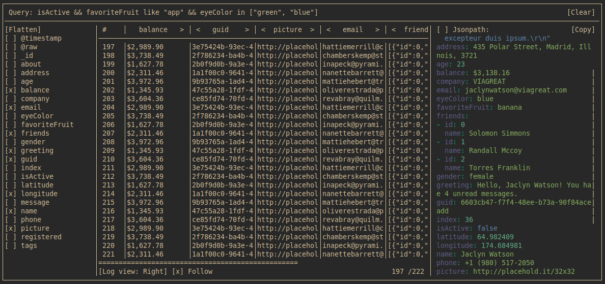

# Monaλog

Monalog is terminal logs observer.



## Installation
  1. Clone the repo
  2. run `cabal install exe:monalog`
  3. Enjoy

## Running 
```bash
monalog --help
Usage: monalog [COMMAND | [FILE] [-f|--format FORMAT] [-d|--default-field FIELD]
                 [-c|--config CONFIG] [-i|--ignore-config ARG]]

Available options:
  FILE                     The format can be derived from the file format. If
                           the file format is .csv, the output will be csv,
                           otherwise it will be json.
  -f,--format FORMAT       Supported formats: json, csv. In the case of csv, the
                           first line is considered the header.
  -i,--ignore-config ARG   Expected values: global, local, all
  -h,--help                Show this help text

Available commands:
  config                   Work with config

monalog my_logs.json
# or 
monalog my_logs.csv
# or
run_logging_server | monalog --format=csv 
# or
run_logging_server | monalog --format=json 
```
## Usage
| Hot key              | Action              |
| -------------------- | ------------------- |
| `Ctrl + q`           | Cleanup logs        |
| `Ctrl + d`           | Exit                |
| `t`                  | Go to top           |
| `b`                  | Go to bottom        |
| `g`                  | Go to               |
| `h`, `left`          | Shift left          |
| `H`, `Shift + left`  | Long shift left     |
| `l`, `right`         | Shift right         |
| `L`, `Shift + right` | Log shift right     |
| `j`, `up`            | Shift up            |
| `J`, `Shift + up`    | Long shift up       |
| `k`, `down`          | Shift down          |
| `K`, `Shift + down`  | Long shift down     |
| `s`                  | Select top line log |
| `scroll`             | Shift up/down       |
| `Ctrl + scroll`      | Shift left/right    |

> **NOTE:** some combinations with `Ctrl` and `Shift` can be handled by your terminal

Mouse is fully supported. You can 
  * click buttons (all text within `[`..`]`)
  * move fields and log entry view bounds.
  * move columns with `<` `>` buttons around header
  * activate query / jsonpath / editors
  * move horizontal view ports
 
## Query language
| Operators    | Details                                                                                                |
| ------------ | ------------------------------------------------------------------------------------------------------ |
| `=` , `!=`   |                                                                                                        |
| `>`, `<`     | Compares `number` with `number`, `string` with `string`, `bool` with `bool`. Otherwise returns `false` |
| `>=`, `<=`   | Exactly `>`/`<` or `=`                                                                                 |
| `&&`, `\|\|` | Works with `bool`. For operands of other types returns `false`                                         |
| `not`        | Negates argument                                                                                       |
| `like`       | Fuzzy text comparison                                                                                  |
| `in`         | Checks if left operand is element of list in right operand`                                            |

| Literal | Example                                    |
| ------- | ------------------------------------------ |
| number  | `5`, `34.2`, `-42`                         |
| string  | `"foo"`, `"foo \"hello\""`                 |
| bool    | `true`, `false`                            |
| array   | `[1, true, "bar"]`                         |
| key     | `_42foo`, `fOooBar`, `$"any \"string\" 1"` |

## Copying
Monalog supports two way to copy data:
  * Native. Monalog calls platform specific commands (which can be overwritten with config). Default commands:
      | OS        | Command           |
      | --------- | ----------------- |
      | `Macos`   | `pbcopy`          |
      | `Windows` | `clip`            |
      | `Linux`   | `xclip -sel clip` |
  * Osc52. Check out if your terminal supports OSC52  

Copying is available in log entry view using `[Copy]` button

## Log view
Log view supports jsonpath queries. Jsonpath filter can be disabled/enabled with checkbox

## Fields view
Monalog automatically detects fields appear in your logs.
Fields view supports 2 display mods
  * Flatten
  * Nested 
   
which can be toggled with button `[Nested]`/`[Flatten]`

## Input formats
| Format | Details                                                                                                                                                                                                 |
| ------ | ------------------------------------------------------------------------------------------------------------------------------------------------------------------------------------------------------- |
| json   | Means `jsonlines`. If line is not valid JSON then line is put to default field of JSON ( `{ "message": "some invalid json" }` ). Default field is `message` but can it be overwritten via cli or config |
| csv    | The first line is supposed to be header                                                                                                                                                                 |


## Config
By default monalog tries load config `monalog.yaml` from `$PWD`. You can disable it with `-i` or `--ignore-config`
You can also specify path to config with `-c` or `--config`
Here is example of monalog config:
```yaml
fields:
  - "@timestamp" # builtin field. Indicates the time when monalog get log line
  - "@raw" # builtin field. Indicates whole log json
  - foo.bar 
format: csv # csv / json
defaultField: data.msg # useful for json only 
copyMethod: native # native / osc52
copyCommand: "xclip -sel clip"
```

Monalog can create config automatically
```bash
monalog config create --global # creates global config
monalog config create # creates local config
```

To find out where is config located use the following command
```bash
monalog config path global
```

To get more info use `--help`

---
Thanks to [@ShrykeWindgrace](https://github.com/ShrykeWindgrace) for help with Windows support implementation